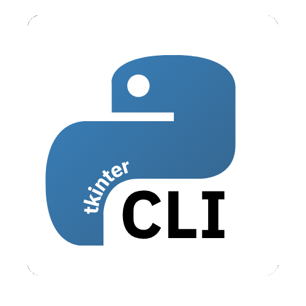

<div align="center">

<h1><br>TkinterCLI - Make Tkinter Development Effortless</h1>

</div>

TkinterCLI est un outil en ligne de commande permettant de simplifier la création de projet avec Tkinter. Grâce à cet outil, vous pouvez rapidement mettre en place une structure de projet complète, gérer un système de navigation multipage et profiter d'icônes préinstallées, le tout sans configuration manuelle fastidieuse.

## Fonctionnalités
- Création de tous les fichiers automatiquement
- Système de navigation multipage
- Icones préinstallés

## Installation
### Depuis PyPi (recommandé)
```
pip install tkintercli
```
### Depuis Github
```
git clone https://github.com/Albatros329/tkintercli.git
cd tkintercli/
python setup.py install
```

## Utilisation

Les arguments entre [] sont obligatoires, tandis que ceux entre () sont facultatifs.

### Créer un nouveau projet
```
tkintercli new [NOM] (--venv)
```

### Ajouter une nouvelle page
```
tkintercli add page [NOM]
```