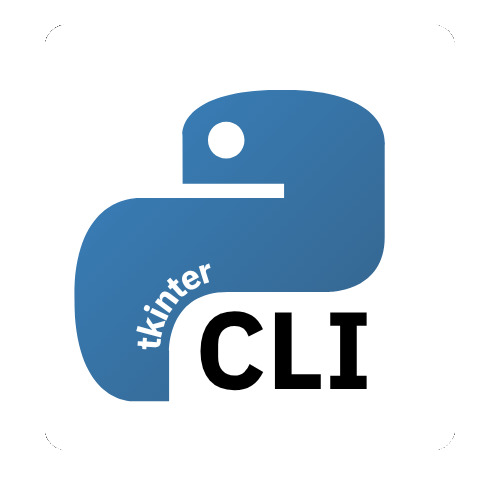

<div align="center">

<h1><br>TkinterCLI - Make Tkinter Development Effortless</h1>

</div>


**:fr: [French](README.md)** - **:gb: [English](README_en.md)**

TkinterCLI is a command-line tool that simplifies project creation with Tkinter. With this tool, you can quickly set up a complete project structure, manage a multi-page navigation system, and take advantage of pre-installed icons, all without tedious manual configuration.

## Features
- **Automatic Project Creation** - Generate a complete Tkinter project structure in a single command
- **Multi-page Navigation System** - Simplified management of interface transitions
- **Built-in Icon Library** - Access to a collection of ready-to-use icons
- **Virtual Environment Support** - Option to automatically create a dedicated virtual environment
- **Organized Architecture** - Clear file structure separating views, controllers, and resources
- **Intuitive Command Line Interface** - Simple commands to create and extend your application

## Installation
### From PyPi (recommended)
```
pip install tkintercli
```
### From Github
```
git clone https://github.com/Albatros329/tkintercli.git
cd tkintercli/
python setup.py install
```

## Usage

Arguments in [] are required, while those in () are optional.

### Create a new project
```
tkintercli new [NAME] (--venv)
```

### Add a new page
```
tkintercli add page [NAME]
```